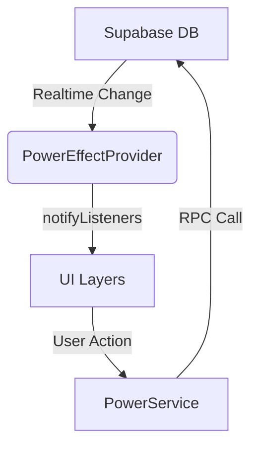

# Documentación de Arquitectura - Juego QR

Este documento describe el flujo de datos, la estructura de poderes y los principios de diseño aplicados en el proyecto.

## 🧱 Flujo de Datos (Data Flow)

El juego utiliza una arquitectura reactiva basada en **Supabase Realtime** y el patrón **Provider**.

### Componentes Clave

1.  **Supabase (B.D.)**: La "Fuente de la Verdad". Estado de jugadores, inventarios y poderes activos.
2.  **AuthService / PowerService**: Capa de abstracción para comunicaciones HTTP/RPC. Siguen DIP (Dependency Inversion Principle).
3.  **Providers (Game/Player/PowerEffect)**: Gestión de estado.
    *   `PowerEffectProvider`: Escucha el canal `active_powers` para aplicar efectos visuales (ataques recibidos).
    *   `GameProvider`: Gestiona el loop principal del juego (pistas, ranking, vidas).
4.  **UI Screens**: Vistas reactivas que consumen providers.

## ⚡ Sistema de Poderes

Los poderes se identifican por un `slug` único.

| Slug | Tipo | Descripción | Duración Típica |
| :--- | :--- | :--- | :--- |
| `freeze` | Ofensivo | Congela la pantalla del rival con un minijuego de hielo. | 15s |
| `black_screen` | Ofensivo | Deja la pantalla totalmente negra. | 10s |
| `blur_screen` | Ofensivo (Área) | Difumina la visión de múltiples rivales (Top 3). | 20s |
| `life_steal` | Ofensivo | Roba una vida al rival y se la da al lanzador. | Instantáneo |
| `shield` | Defensivo | Protege contra cualquier ataque entrante. | 60s |
| `invisibility` | Defensivo | Desaparece del ranking temporalmente. | 45s |
| `return` | Defensivo | "Espejo Mágico". Devuelve el siguiente ataque al lanzador. | Hasta activarse / 60s |

## 🏗️ Principios SOLID Aplicados

### 1. SRP (Single Responsibility Principle)
*   Se ha separado la lógica de ejecución de poderes complejos (`blur_screen`) de la lógica simple (`use_power_mechanic` RPC), delegando la complejidad al servidor cuando es posible o a servicios especializados.

### 2. OCP (Open/Closed Principle)
*   **En Progreso**: Estamos migrando de `switch(slug)` a un patrón de Estrategia para facilitar la adición de nuevos poderes sin modificar `PowerEffectProvider.dart`.

### 3. DIP (Dependency Inversion Principle)
*   La UI (`ShopScreen`) no depende directamente de `SupabaseClient`.
*   La UI solicita datos a `PlayerProvider`, quien delega en `PowerService`.
*   Esto permite cambiar la implementación del backend (ej: Firebase) sin tocar la UI.

## 🚀 Guía para Contribuidores

1.  **Nuevas Features**: Si agregas una pantalla, asegúrate de que use un `Provider` existente o crea uno nuevo si el estado es complejo.
2.  **Base de Datos**: No llames a `Supabase.instance` desde los Widgets. Crea un método en el Servicio correspondiente.
3.  **Documentación**: Si creas un método público en un Provider, añade `/// Docstrings`.
